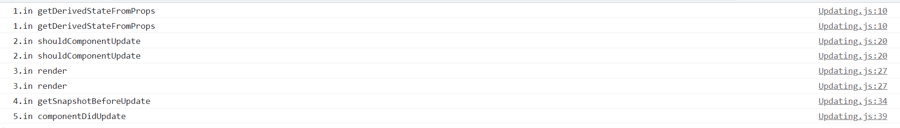

# Class component updating Lifecycle

כאשר קומפוננטה מתעדכנת רצות 5 פונקציות לפי הסדר הזה:

1. static getDerivedStateFromProps()
1. shouldComponentUpdate()
1. render()
1. getSnapshotBeforeUpdate()
1. componentDidUpdate()

## getDerivedStateFromProps

קיים למטרה אחת בלבד - לעדכן את ה state הפנימי של קומפוננטה לפי הprops שמגיע מבחוץ

## shouldComponentUpdate

מאפשר לנו להמנע מעדכון מחדש של הקמופוננטה, משמש בעיקר לאופטימיזציה של הביצועים

## render

הjsx שהקומפוננטה מחזירה

## getSnapshotBeforeUpdate

הפונקציה מופעל ממש לפני שהפלט של הפונקציה render יוצג

מאפשר לקומפוננטה ללכוד מידע מה-DOM לפי שהוא משתנה

כל ערך שיוחזר מהפונקציה יעבור כפרמטר לcomponentDidUpdate

## componentDidUpdate

הפונקציה הזאת מופעל מיד לאחר העדכון. היא לא נקראת אחרי הרינדור הראשון של הקומפוננטה
